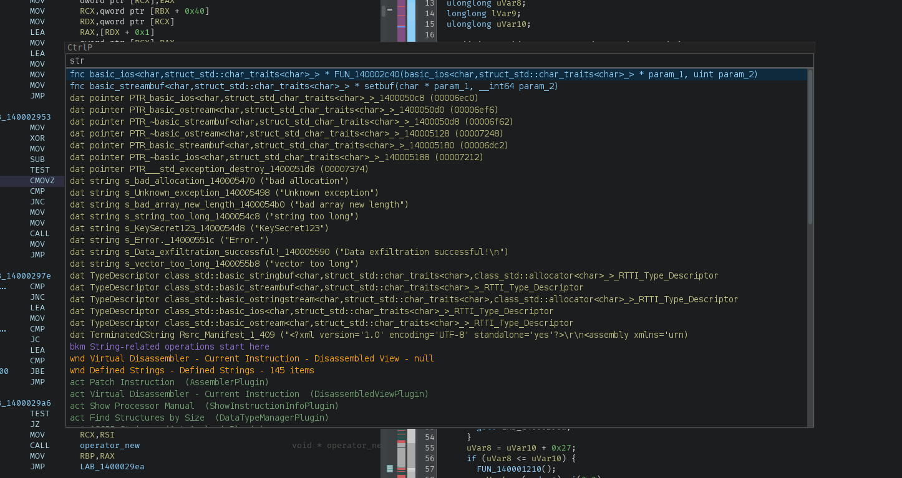

# Ghidra CtrlP Script

Ghidra is great, but I hate how mouse-driven it is by default. One thing
I love in VS Code is the Ctrl+P file switcher and command pallete. I figured,
it would be nice to have this in ghidra.

With this script you can just press Ctrl+P and do ~~anything~~ a lot.

### Installation

I guess put it in `~/ghidra_scripts` or your prefered script location.
Then go to `Window -> Script manager`, reload, and the script should be visible.

I strongly recommend adding a keyboard shortcut to this script (doable from script manager).
I'm not a cop, it's OK if you assign something else than `Ctrl+P`. If you do assign `Ctrl+P`
remember to unasign `Print` in the `Tool Options -> Keybindings`, otherwise Ghidra will
ask you an annoying question every time.

### Basic features

When you press Ctrl+P, a modal window appears and you may enter a search term/command.

Searchable entries are defined for:

* Functions:
    * For example `fnc int __scrt_common_main_seh(void)`.
    * You can quickly skim available function signatures and navigate to them.

* Defined data:
    * For example `dat pointer PTR_ReadFile_140005000 (06b90)`.
    * Just like with functions, you can jump to data defined in memory.

* Labels:
    * For example `lbl IMAGE_DOS_HEADER_1400000000.e_lfanew`.
    * Technically in Ghidra "data" are just labels too. Labels without associated type
        are usually less interesting, and are displyed differently.
    * Also all labels coming from automated analysis with names starting from `LAB_`
        are ignored.

* Bookmarks:
    * For example `bmk Your bookmark goes here`.
    * I could never get into bookmarks in Ghidra, even though I like the idea.
        Mostly because how unwieldy to use they are (in my opinion). The ability to
        quickly jump to any bookmark improves this significantly.

* Windows/Panes:
    * For example `wnd Function Graph - Function Graph - null`.
    * Technically they are called "components", not windows.
    * You can quickly open and focus, for example, a `Python` window without doing painful menu searches with mouse.

* Scripts:
    * For example `scr AddMapping.java`.
    * Pretty obvious - you can launch any script by just knowing a part of its name
        and typing it.

* Available actions
    * For example `act Edit Options (Tool)`, but also `act Retype Variable (DecompilePlugin)`.
    * This is a quite powerful feature, as it lets you do anything you could do with a mouse.
        For example, everything you would see in a context menu for the current location will be visible.
    * More generally, everything that you can assign a keyboard shortcut is possible to do from  the list.
    * Just remember that this is influenced by the current cursor location (just like context menu is).

### Slightly more advanced features

**Keybindings**

Other than the obvious (arrows, home/end, page up/down), you can press:

* `ENTER` - accept the current selection (go to the selected location, or execute the selected script, etc).
* `ESC` - close the current window without doing anything
* `Ctrl+c` - copy a text of the highlighted element
* `Ctrl+Shift+c` - copy address (if any) of the highlighted element
* `Ctrl+d` - toggle a quick bookmark at the highlighted location (add, or remove if exists). Bookmarked symbols are shown with a star `[⭐]`.

**Filtering**

Ideally we would filter with something fzf-like, but I didn't want to spend too much time inventing it.
The filtering works like this: user input is split on whitespace, for example `main get int` is split into `["main", "get", "int"]`.
To match, text must contain ALL of these fragments. In practice this seems to work very well for me.

One exception is that if a chunk is equal to "fnc", "bkm", "scr"... exactly, then we are doing filtering by type (so if you type "fnc main" you will get only functions with main, but not for example `dat string PTR_CompanyDomain`).

**Searching**

One edgy feature that I added is the ability to search in the program memory. There are three modes:

* `"` - Case sensitive text search 
* `'` - Case insensitive text search 
* `{` - Byte search (written in hex, wildcards not supported).

It seems to work well in my tests, but it's **not** optimized, and it will hurt on large files.

Yeah, in general this program is not optimized significantly (only startup time was optimized a bit).

**Other notes**

The plugin tries to use `"FiraCode Nerd Font Mono"` font, and if that fails it falls back to `"Monospaced"`.
In the future maybe I'll try to get the default font for listing for example.

There is a support for dark theme (the same colors as in listing are used, but unrelated to their original semantics).

### Disclaimer

Code quality of this script is terrible, I can also write good code I promise.

I'm currently dogfooding it, and if I like it in my daily work I'll probably keep udating it.
